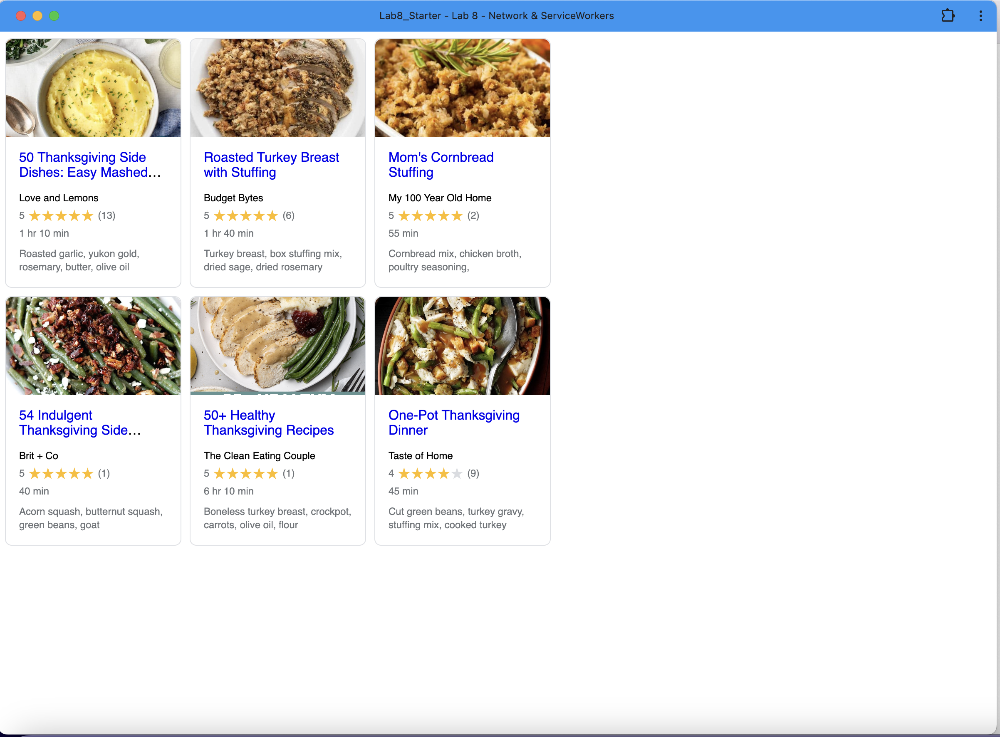

# Lab8-Starter

-Deployed GitHub Pages URL:
https://keanooo7.github.io/Lab8_Starter/

-Short paragraph about graceful degradation and service workers.
    Graceful degradation flips progressive enhancement on its head: we build our app assuming full JavaScript power and service-worker support, then ensure it still works—albeit at a reduced level—when those features or the network itself aren’t available. By registering a service worker (a background, multithreaded script separate from our DOM), we can intercept every network request for HTML, CSS, JS, images, and recipe JSON, cache the responses locally, and then serve those cached assets on subsequent requests. That way, even in airplane mode or on a painfully slow connection—as RAIL principles remind us about human impatience—the app falls back to previously fetched resources, preserving usability, performance, and resilience when the internet fails.

-pwa.png:

